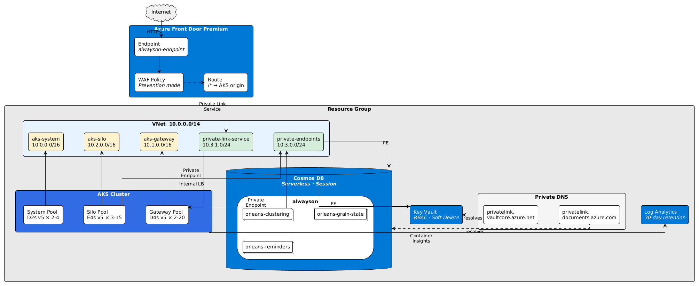

A ramp-up project for Senior Software Engineers at Microsoft, architecturing a globally scalable low-latency API utilising:

- Orleans 10
- AKS (Kubernetes 1.33)
- CosmosDB (AAD auth via workload identity)
- Azure Container Registry
- Azure Cache for Redis (AAD auth via workload identity)
- Azure Event Grid (pull delivery)
- Azure Key Vault
- Azure Front Door Premium
- Azure Monitor (Container Insights + Managed Prometheus)
- ASP.NET Core 10 / .NET Aspire
- Bicep for IaC
- GitHub Actions CI/CD

---

### Application Layer

The scenario being scaled is a replica of Ticketmaster, the distribution of events with tickets purchasable globally. Atomic purchases of specific seats, allocation of categorised sales (pre-sale, early bird, general admission etc) and event history offers a breadth of functionality to demonstrate the utility of the tech stack.

The architecture leans into Orleans' strengths rather than fighting them with HTTP boundaries between services. Grain-to-grain communication within a single cluster is sub-millisecond and avoids the serialisation overhead of cross-service HTTP calls, making it the natural fit for the tightly coupled flows of seat reservation, order creation and payment confirmation.

There are two discrete build artefacts and a shared library:

- **Silo** — The Orleans silo hosting all grain implementations and the public-facing ASP.NET Core API (endpoints, SignalR hub). Sits behind Azure Front Door via a Kubernetes `LoadBalancer` service. Scales based on grain count and CPU utilisation.
- **Shared** — A class library containing grain interfaces, shared DTOs and constants, referenced by the Silo and integration tests.
- **ServiceDefaults** — Aspire service defaults (OpenTelemetry, health checks, resilience).

#### Grain Design

Orleans guarantees single-threaded execution per grain, eliminating the need for distributed locks or optimistic concurrency conflicts. The grain topology is designed to maximise parallelism across high-contention paths:

- **EventGrain** (one per event) — Holds event metadata: name, venue, dates, sale categories. Low contention; only admins write to it.
- **SectionGrain** (one per event × section) — Owns the seat availability bitmap for its section. A 20,000-seat arena with ~30 sections yields 30-way parallelism for concurrent seat operations, avoiding a single-grain bottleneck.
- **OrderGrain** (one per order) — A state machine (`Created → SeatsHeld → PaymentProcessing → Confirmed/Failed`). Uses Orleans reminders for expiry; if payment doesn't complete within a configured window the grain releases its held seats and cancels the order, replacing the need for an external saga orchestrator.
- **UserGrain** (one per user) — Profile data and order history references. Keeps the user's active session cached in-memory to avoid unnecessary database queries.

#### Purchase Flow

1. The user reserves a seat via `POST /events/{id}/sections/{sectionId}/reserve`, which calls `SectionGrain.ReserveAsync`.
2. The SectionGrain checks its bitmap, marks the seat as held and returns success or failure.
3. The endpoint creates an `OrderGrain`, which transitions to `SeatsHeld` and registers an expiry reminder.
4. On payment, the OrderGrain calls the payment provider, then makes grain-to-grain calls to `SectionGrain.ConfirmSeatAsync` and `UserGrain.AddOrderAsync` — no HTTP, no serialisation, just in-memory routing within the cluster.

#### Reservation Queue

High-demand on-sales are absorbed by an Event Grid–driven reservation queue rather than a synchronous HTTP facade:

- `ReservationQueueGrain` (one per event) owns the FIFO waiting list and a bounded pool of concurrent reservation holders.
- Requests `POST /events/{id}/queue` enqueue the user; as slots open, the grain promotes the next waiter, publishes a `ReservationReadyMessage` to the `reservations` Event Grid namespace topic and mirrors the state into Redis (`queue:{queueId}`).
- An in-silo SignalR hub (`/hubs/queue`) subscribes each connected user to a per-user group. The `ReservationReadyConsumer` background service pulls events from the `reservations-ready` subscription and pushes `ReservationReady` to the correct group, so the client's WebSocket promotes instantly instead of waiting for the next `/myqueue` poll.
- Reservations expire after **3 minutes** via an Orleans reminder on the queue grain; the slot returns to the pool and the next waiter is promoted.
- `GET /myqueue/{queueId}` reads from the Redis mirror, so queue-position polling is cheap under load.

#### Caching

`GET /events/{id}` — the hot read path — is fronted by a Redis cache with a 60-second TTL, populated by the grain on miss and invalidated by `POST /events`.

---

### Infrastructure

All infrastructure is defined in Bicep, modularised under `infra/` with a single `main.bicep` entry point composing discrete modules for networking, compute, data and edge.



##### Networking

A `/14` VNet is partitioned into dedicated subnets: one per AKS node pool (system, gateway, silo) and a shared private endpoint subnet for all PaaS services (Cosmos DB, Key Vault, Redis, Event Grid). Private DNS zones for `privatelink.documents.azure.com`, `privatelink.vaultcore.azure.net`, `privatelink.redis.cache.windows.net` and `privatelink.eventgrid.azure.net` are linked to the VNet, ensuring all PaaS traffic resolves over the private backbone. No public endpoints are exposed on any backing service.

The Silo is reached via a public Azure Load Balancer (the k8s `silo-service`), but a network security group on the `aks-system` subnet restricts inbound traffic to the `AzureFrontDoor.Backend` service tag (plus the `AzureLoadBalancer` tag for health probes and intra-VNet traffic). All other internet-sourced traffic is denied at the subnet boundary, so Azure Front Door is the only external path that can reach the cluster.

##### Compute — AKS

A single AKS cluster hosts one system node pool on the `aks-system` VNet subnet:

- **System** (`Standard_D2s_v6`, 2–5 nodes) — Runs all workloads including the Orleans Silo deployment. Azure CNI networking, autoscaling enabled.

The VNet also reserves `aks-gateway` and `aks-silo` subnets for future dedicated workload pools. Workload identity and OIDC issuer are enabled for keyless AAD authentication to Azure services (Cosmos DB). The cluster auto-upgrades on the `stable` channel.

##### Data — CosmosDB

A provisioned-autoscale CosmosDB account (1,000 RU/s max, Session consistency) in northeurope hosts the `alwayson` database with three containers:

- `orleans-clustering` (partitioned on `/ClusterId`) — Silo membership table.
- `orleans-grain-state` (partitioned on `/PartitionKey`) — Persistent grain state.
- `orleans-reminders` (partitioned on `/PartitionKey`) — Reminder registrations.

The account is accessible only via a private endpoint in the shared PE subnet; public network access is disabled entirely. Local (key-based) auth is disabled — the Silo authenticates using `WorkloadIdentityCredential` via a User-Assigned Managed Identity with the Cosmos DB Built-in Data Contributor role, federated to the `silo-sa` Kubernetes service account through AKS workload identity. Automatic failover is enabled.

##### Secrets — Key Vault

A Standard-tier Key Vault is deployed with RBAC authorisation, soft delete (90-day retention) and no public network access via a private endpoint in the shared PE subnet. No connection strings are stored in application configuration — Cosmos access uses AAD tokens via workload identity.

##### Cache — Azure Cache for Redis

A Standard-tier Redis 6.x instance with `disableAccessKeyAuthentication: true` (AAD-only), `publicNetworkAccess: Disabled` and TLS 1.2 minimum. The Silo's managed identity is granted the built-in `Data Contributor` access policy; traffic is routed via a private endpoint in the shared PE subnet with the `privatelink.redis.cache.windows.net` DNS zone linked to the VNet. Used for the `GET /events/{id}` read cache and the queue-position mirror.

The Redis connection is initialised asynchronously via a `Lazy<Task<IConnectionMultiplexer>>` singleton to avoid blocking the .NET thread pool during startup — a synchronous `GetAwaiter().GetResult()` call during DI resolution was found to cause 10+ second thread pool starvation, freezing Orleans membership timers. The `WorkloadIdentityCredential` token is acquired via `ConfigureForAzureWithTokenCredentialAsync` using the RESP2 protocol (required for Basic/Standard Redis 6.x).

##### Messaging — Azure Event Grid

A Standard-tier Event Grid Namespace with public access disabled and TLS 1.2 minimum. A `reservations` namespace topic with a `reservations-ready` queue event subscription carries reservation-ready events produced by `ReservationQueueGrain` and consumed by the in-silo `ReservationReadyConsumer` via pull delivery, which fans them out over SignalR. The Silo identity is granted the `EventGrid Data Sender` and `EventGrid Data Receiver` roles at namespace scope; traffic flows via a private endpoint with `privatelink.eventgrid.azure.net`.

##### Observability — Azure Monitor

- **Log Analytics Workspace** — 30-day retention, ingests Container Insights logs from AKS via a dedicated Data Collection Rule (DCR) and DCR Association (DCRA).
- **Azure Monitor Workspace** — Managed Prometheus metric store, fed by a Prometheus-forwarder DCR scraping the AKS metrics addon.
- **Data Collection Endpoint** — Shared ingestion endpoint for both the Container Insights and Prometheus DCRs.

The AKS addon uses `useAADAuth: true` for Container Insights, which requires both a CI DCR targeting the LAW and a DCRA scoped to the cluster — without these, the `ama-logs` agent fails onboarding silently.

##### Edge — Azure Front Door

Azure Front Door Premium acts as the global entry point, terminating TLS and routing traffic to the AKS public load balancer via a pre-allocated static Standard Public IP. Direct-to-origin access is blocked at the NSG layer (see Networking above), so AFD is the only external path into the cluster. A WAF policy runs in Prevention mode with Microsoft Default Rule Set 2.1 and Bot Manager Rule Set 1.1. A custom rate-limit rule caps requests at 1,000 per minute per client IP.

---

### Benchmarks

Load tested with [`hey`](https://github.com/rakyll/hey) — 10,000 requests, 500 concurrent connections against `GET /events/{id}` through the full Azure Front Door → AKS path.

#### Baseline — Synchronous (single event grain)

| Metric | Value |
|---|---|
| **Requests/sec** | **1,796** |
| **Total time** | 5.57s |
| **Avg latency** | 178ms |
| **P50 latency** | 53ms |
| **P90 latency** | 321ms |
| **P99 latency** | 2.46s |
| **Fastest** | 20ms |
| **Slowest** | 4.82s |
| **Success rate** | 100% (10,000 × 200) |

<details>
<summary>Full output</summary>

```
Response time histogram:
  0.020 [1]     |
  0.499 [9320]  |■■■■■■■■■■■■■■■■■■■■■■■■■■■■■■■■■■■■■■■■
  0.979 [163]   |■
  1.458 [99]    |
  1.938 [127]   |■
  2.417 [126]   |■
  2.897 [163]   |■
  3.376 [0]     |
  3.856 [0]     |
  4.335 [0]     |
  4.815 [1]     |

Latency distribution:
  10% in 0.0308s
  25% in 0.0398s
  50% in 0.0526s
  75% in 0.0718s
  90% in 0.3209s
  95% in 1.0518s
  99% in 2.4570s

Details (average, fastest, slowest):
  DNS+dialup:   0.0035s, 0.0000s, 0.2812s
  DNS-lookup:   0.0043s, 0.0000s, 1.0637s
  req write:    0.0001s, 0.0000s, 0.0402s
  resp wait:    0.1327s, 0.0194s, 4.7902s
  resp read:    0.0010s, 0.0000s, 0.3861s
```

</details>

#### After Redis AAD Fix + Async Init

| Metric | Value |
|---|---|
| **Requests/sec** | **4,418** |
| **Total time** | 2.26s |
| **Avg latency** | 95ms |
| **P50 latency** | 81ms |
| **P90 latency** | 127ms |
| **P99 latency** | 421ms |
| **Fastest** | 23ms |
| **Slowest** | 747ms |
| **Success rate** | 100% (10,000 × 200) |

<details>
<summary>Full output</summary>

```
Response time histogram:
  0.023 [1]     |
  0.096 [6902]  |■■■■■■■■■■■■■■■■■■■■■■■■■■■■■■■■■■■■■■■■
  0.168 [2527]  |■■■■■■■■■■■■■■■
  0.240 [66]    |
  0.312 [107]   |■
  0.385 [158]   |■
  0.457 [214]   |■
  0.529 [21]    |
  0.602 [0]     |
  0.674 [0]     |
  0.746 [4]     |

Latency distribution:
  10% in 0.0476s
  25% in 0.0598s
  50% in 0.0814s
  75% in 0.1004s
  90% in 0.1265s
  95% in 0.2442s
  99% in 0.4206s

Details (average, fastest, slowest):
  DNS+dialup:   0.0038s, 0.0000s, 0.2980s
  DNS-lookup:   0.0021s, 0.0000s, 0.0422s
  req write:    0.0001s, 0.0000s, 0.0259s
  resp wait:    0.0736s, 0.0231s, 0.4950s
  resp read:    0.0009s, 0.0000s, 0.3689s
```

</details>

